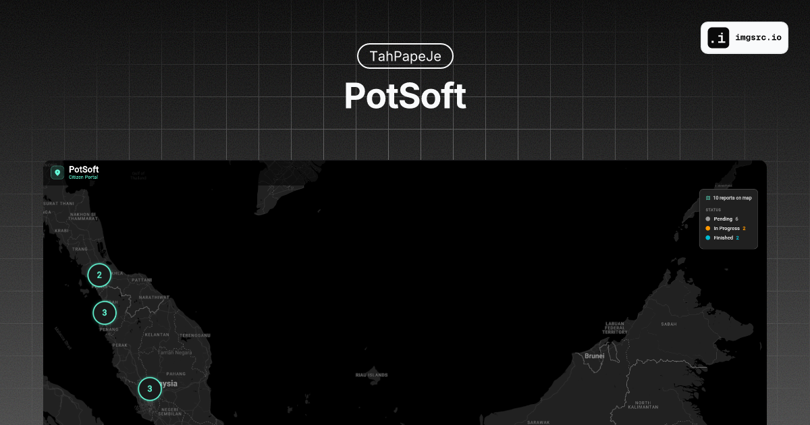

# PotSoft - KitaHack 2026



**Team CYBERTROOPER**

PotSoft is an AI-powered pothole detection and reporting platform for Malaysia. Citizens photograph road damage, the system analyses it with Google Gemini Vision, and contractors triage repairs from a real-time dashboard.

---

## Problem

Malaysian roads suffer from persistent potholes that go unreported or take weeks to reach the right local authority. Manual inspections are slow, and citizens lack a simple way to flag hazards.

## Solution

PotSoft closes the loop between citizens and road maintenance contractors:

1. **Citizen Portal** -- snap a photo, pinpoint the location, submit.
2. **Gemini Vision Analysis** -- the image is sent to `gemini-2.5-flash`, which returns severity (Small / Medium / Large), priority colour (Green / Yellow / Red), and estimated repair time.
3. **Jurisdiction Resolver** -- GPS coordinates are matched to the responsible Malaysian local authority (JKR, MBPP, DBKL, etc.) using a haversine-distance lookup.
4. **Contractor Dashboard** -- filterable report list, analytics charts, and a live map with priority-coded markers. Contractors can update status (In Progress / Finished) with a single click.

## Tech Stack

| Layer    | Technology                                |
| -------- | ----------------------------------------- |
| Frontend | Flutter Web (Dart), Google Maps, Provider |
| Backend  | FastAPI (Python), Uvicorn                 |
| AI       | Google Gemini 2.5 Flash (Vision API)      |
| Data     | In-memory store (prototype)               |

## Project Structure

```
KitaHack2026/
  backend/          Python FastAPI server
  frontend/         Flutter web application
  README.md         This file
```

See `backend/README.md` and `frontend/README.md` for setup instructions specific to each part.

## Quick Start

### Prerequisites

- Python 3.10+
- Flutter SDK 3.11+
- A Google Gemini API key

### 1. Start the backend

```bash
cd backend
pip install -r requirements.txt
echo GEMINI_API_KEY=your_key_here > .env
uvicorn main:app --reload
```

The API will be available at `http://localhost:8000`.

### 2. Start the frontend

```bash
cd frontend
flutter pub get
flutter run -d chrome
```

The app opens in Chrome. The citizen portal is at `/`, the contractor dashboard at `/dashboard`.

## API Overview

| Method | Endpoint                   | Description                     |
| ------ | -------------------------- | ------------------------------- |
| GET    | `/api/reports`             | List all pothole reports        |
| POST   | `/api/reports`             | Submit new report (image + GPS) |
| PATCH  | `/api/reports/{id}/status` | Update report status            |
| POST   | `/analyze`                 | Standalone image analysis       |

## Google Technologies Used

- **Gemini 2.5 Flash** -- image analysis and severity classification
- **Google Maps Flutter** -- interactive dark-mode map with custom markers and clustering

## License

Built for KitaHack 2026. All rights reserved by Team CYBERTROOPER.
