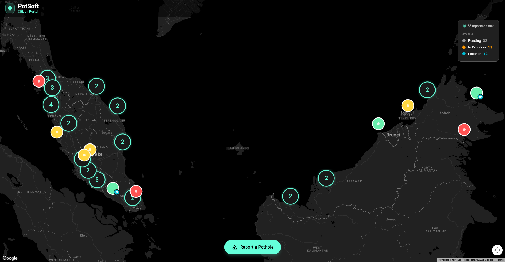
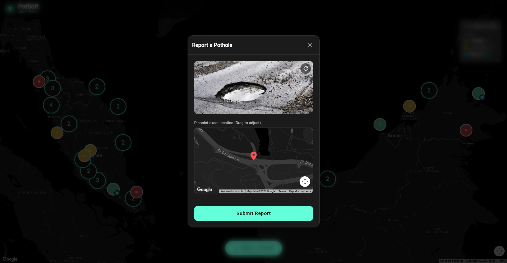
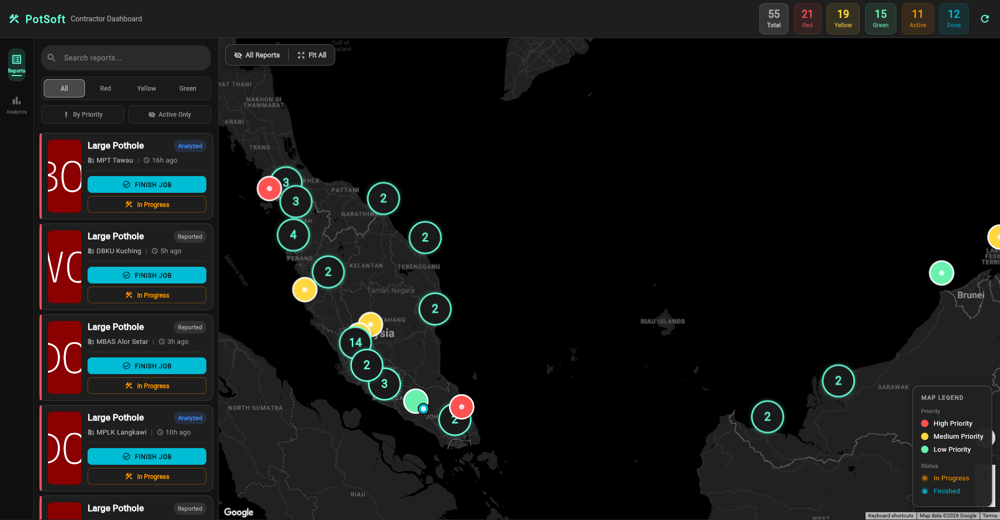
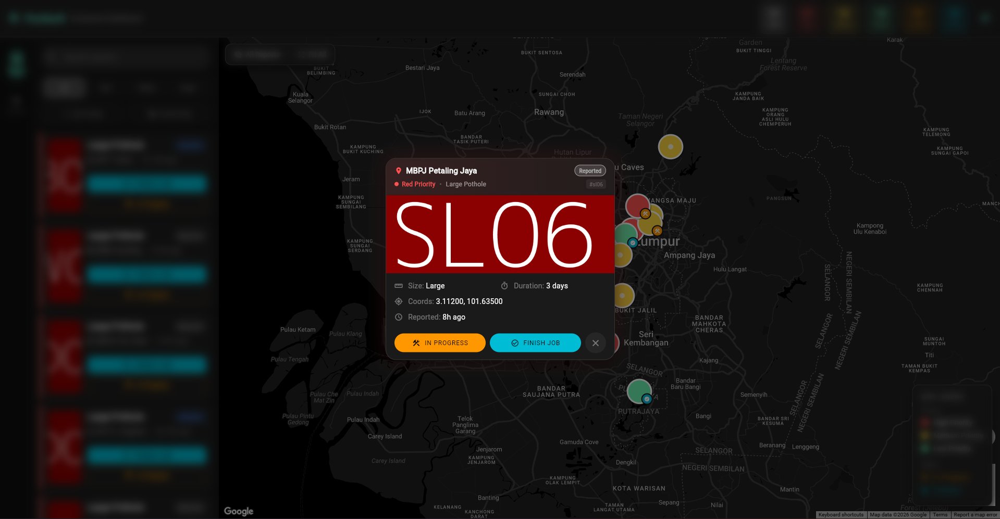
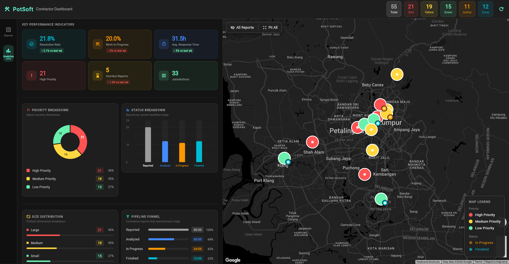
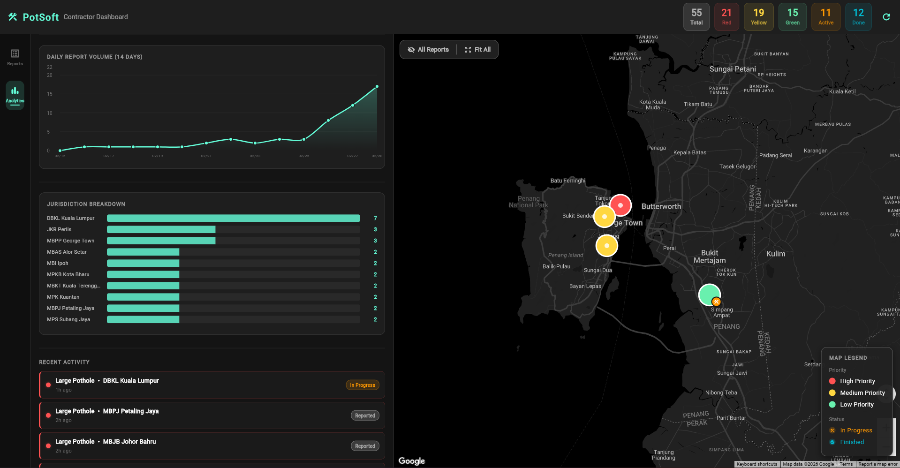

# PotSoft - AI-Powered Pothole Detection and Reporting Platform


**Team CYBERTROOPER | KitaHack 2026**

PotSoft is an AI-powered civic infrastructure platform that transforms how Malaysians report potholes and how local authorities prioritize repairs. Citizens photograph road damage, the system instantly analyzes the image using Google Gemini Vision, classifies severity, identifies the responsible local authority from 40+ Malaysian jurisdictions, and routes the report to a contractor dashboard where AI-generated priority recommendations tell maintenance crews exactly which pothole to fix first and why.

---

## Table of Contents

- [Problem](#problem)
- [Solution](#solution)
- [Screenshots](#screenshots)
- [Tech Stack](#tech-stack)
- [Architecture](#architecture)
- [Project Structure](#project-structure)
- [Quick Start](#quick-start)
- [API Reference](#api-reference)
- [Google Technologies Used](#google-technologies-used)
- [SDG Alignment](#sdg-alignment)
- [Future Roadmap](#future-roadmap)
- [License](#license)

---

## Problem

Malaysia's road maintenance system is broken at every stage of the reporting-to-repair pipeline.

**Citizens face three barriers:**

- They do not know which of the 149 local authorities (PBTs, MPPs, MBs, DBKL, JKR offices) is responsible for their stretch of road.
- Existing complaint channels are fragmented - SISPAA, council Facebook pages, WhatsApp groups, phone calls - each operating independently with no unified tracking.
- There is no feedback loop. Citizens who report a pothole have no way to track whether it was received, prioritized, or scheduled for repair.

**Local authorities face three operational failures:**

- Incoming complaints arrive with no standardized severity assessment.
- There is no prioritization system - complaints are processed in arrival order, not by urgency.
- No authority tracks its own average response time, resolution rate, or overdue report count.

**The human cost is real.** In 2024, approximately 6,606 accident cases involved motorcyclists hitting or swerving to avoid potholes on Malaysian roads.

## Solution

PotSoft closes the loop between citizens and road maintenance contractors through four integrated stages:

1. **Citizen Portal** - Take a photo, pinpoint the location, submit. No form fields, no department selection, no account creation. One photo, one tap.
2. **Gemini Vision Analysis** - The image is sent to Gemini 2.5 Flash, which returns severity (Small / Medium / Large), priority color (Green / Yellow / Red), and estimated repair time in under 3 seconds.
3. **Jurisdiction Resolver** - GPS coordinates are matched to the responsible Malaysian local authority (JKR, MBPP, DBKL, etc.) using haversine-distance lookup against 40+ reference points within a 50 km radius.
4. **Contractor Dashboard** - Filterable report list, six KPI cards with trend indicators, five analytics charts, a live priority map, and Gemini AI-generated insights including executive summaries, trend analysis, priority recommendations, and jurisdiction scorecards.

---

## Screenshots

### Citizen Portal - Map View

<p align="center">
  
</p>

### Citizen Portal - Report Submission

<p align="center">
  
</p>

### Contractor Dashboard - Report Management

<p align="center">
  
</p>

### Contractor Dashboard - Report Details

<p align="center">
  
</p>

### Contractor Dashboard - Analytics and KPIs

<p align="center">
  
</p>

<p align="center">
  
</p>

---

## Tech Stack

| Layer              | Technology                         | Purpose                                                                 |
| ------------------ | ---------------------------------- | ----------------------------------------------------------------------- |
| **Frontend**       | Flutter (Web), Provider            | Dual-portal UI - citizen reporting and contractor dashboard             |
| **Backend**        | FastAPI (Python), Uvicorn          | REST API, jurisdiction resolution, Gemini API orchestration             |
| **AI - Vision**    | Google Gemini 2.5 Flash            | Real-time image analysis, severity classification, priority ranking     |
| **AI - Analytics** | Google Gemini 2.5 Flash Lite       | Executive summaries, trend analysis, jurisdiction scorecards            |
| **Maps**           | Google Maps Platform (Flutter SDK) | Interactive dark-mode maps with color-coded priority markers            |
| **Data Store**     | In-memory (Python)                 | Prototype storage with abstraction layer for future Firestore migration |

---

## Architecture

```
  FRONTEND (Flutter Web)
  ┌──────────────────┐      ┌──────────────────────────┐
  │  CITIZEN PORTAL   │      │  CONTRACTOR DASHBOARD    │
  │  - Google Map     │      │  - Filterable reports     │
  │  - Photo capture  │      │  - Analytics + 6 KPIs    │
  │  - Report dialog  │      │  - 5 charts              │
  │  - Status legend  │      │  - Gemini AI Insights    │
  └────────┬─────────┘      └────────────┬─────────────┘
           └──────────────┬───────────────┘
                          │ HTTP REST
                          ▼
  BACKEND (FastAPI + Python)
  ┌─────────────────┐  ┌───────────────────────────────┐
  │  Report Engine   │  │  AI Service Layer             │
  │  POST /report    │  │  Gemini 2.5 Flash (Vision)   │
  │  GET  /reports   │  │  Gemini 2.5 Flash Lite       │
  │  PATCH /status   │  │  (Analytics)                  │
  └────────┬─────────┘  └───────────────────────────────┘
           │
  ┌─────────────────┐  ┌───────────────────────────────┐
  │  Jurisdiction    │  │  In-Memory Data Store         │
  │  Resolver        │  │  Reports, status history,     │
  │  40+ authorities │  │  AI classification cache      │
  └─────────────────┘  └───────────────────────────────┘
```

---

## Project Structure

```
KitaHack2026/
  backend/
    main.py                 FastAPI app entry point
    store.py                In-memory report storage
    routes/
      analyze.py            Standalone analysis endpoint
      reports.py            Report CRUD endpoints
      insights.py           AI insights endpoint
    services/
      gemini_service.py     Gemini Vision integration
      insights_service.py   Gemini analytics integration
      jurisdiction.py       GPS-to-authority resolver
    schemas/
      response_model.py     Pydantic response models
  frontend/
    lib/
      main.dart             App entry point, Provider setup
      routing/
        app_router.dart     GoRouter with / and /dashboard
      core/
        models/             Data classes
        providers/          State management
        services/           API client, marker service
        theme/              Material theme, design tokens
        widgets/            Shared UI components
      features/
        citizen/            Citizen portal screens + widgets
        contractor/         Dashboard screens + widgets
```

See `backend/README.md` and `frontend/README.md` for detailed setup instructions.

---

## Quick Start

### Prerequisites

- Python 3.10+
- Flutter SDK 3.11+
- A Google Gemini API key ([get one here](https://aistudio.google.com/app/apikey))

### 1. Start the backend

```bash
cd backend
pip install -r requirements.txt
echo GEMINI_API_KEY=your_key_here > .env
uvicorn main:app --reload
```

The API will be available at `http://localhost:8000`. Interactive docs at `http://localhost:8000/docs`.

### 2. Start the frontend

```bash
cd frontend
flutter pub get
flutter run -d chrome
```

The app opens in Chrome. The citizen portal is at `/`, the contractor dashboard at `/dashboard`.

> **Note:** To point at a different backend URL, use `flutter run -d chrome --dart-define=API_URL=https://your-api.run.app`.

---

## API Reference

| Method | Endpoint                   | Description                            |
| ------ | -------------------------- | -------------------------------------- |
| GET    | `/api/reports`             | List all pothole reports               |
| POST   | `/api/reports`             | Submit new report (image + GPS)        |
| PATCH  | `/api/reports/{id}/status` | Update report status                   |
| POST   | `/analyze`                 | Standalone image analysis              |
| POST   | `/api/insights`            | Generate AI analytics from report data |

---

## Google Technologies Used

- **Gemini 2.5 Flash** - Multimodal vision analysis for real-time pothole image classification, severity assessment, and repair estimation. Chosen over alternatives because it combines vision analysis with structured JSON output in under 3 seconds.
- **Gemini 2.5 Flash Lite** - Text-based analytics for executive summaries, trend analysis, priority recommendations, and jurisdiction scorecards. Splitting workload across two models prevents citizen submissions from consuming quota needed for contractor analytics.
- **Google Maps Platform (Flutter SDK)** - Interactive dark-mode maps with color-coded priority markers, clustering, and custom tooltips. Chosen for its comprehensive Malaysian road data coverage, including kampung roads and rural routes.
- **Google AI Studio** - Used during development to iterate across 20+ prompt variations against real pothole images, compressing days of prompt engineering into hours.

---

## SDG Alignment

**SDG 11 - Sustainable Cities and Communities.** PotSoft directly addresses safe, accessible transport systems and universal access to safe public spaces. Potholes disproportionately affect vulnerable road users - motorcyclists make up 48% of Malaysian road users and face the highest risk from road surface hazards.

**SDG 9 - Industry, Innovation, and Infrastructure.** PotSoft applies AI to infrastructure maintenance, introducing automated severity classification, GPS-based jurisdiction routing, and AI-generated priority recommendations that optimize repair crew deployment for maximum safety impact.

---

## Future Roadmap

**Phase 1 - Production Foundation (Months 1-12)**

- Migrate to Firebase Firestore for persistent storage and real-time sync
- Add Firebase Authentication for contractor accounts
- Deploy Flutter mobile app to Android and iOS from existing codebase
- Pilot with 2-3 local councils in Perak and Kuala Lumpur

**Phase 2 - National Scale (Months 13-36)**

- Integrate with SISPAA government portal as an AI triage layer
- Add AI-powered duplicate detection using GPS proximity and image similarity
- Partner with highway concessionaires (PLUS, ANIH, Gamuda)
- Introduce predictive maintenance using historical data and weather patterns
- Expand to general-purpose municipal infrastructure (streetlights, drainage, signage)

---

## License

Built for KitaHack 2026. All rights reserved by Team CYBERTROOPER.
